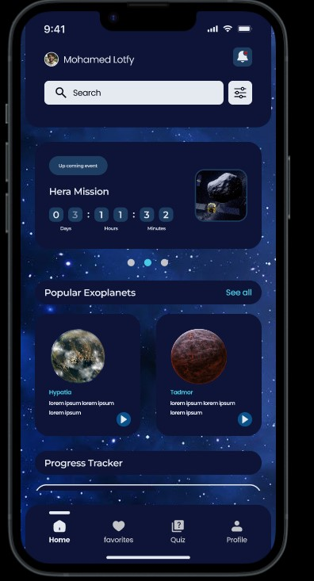
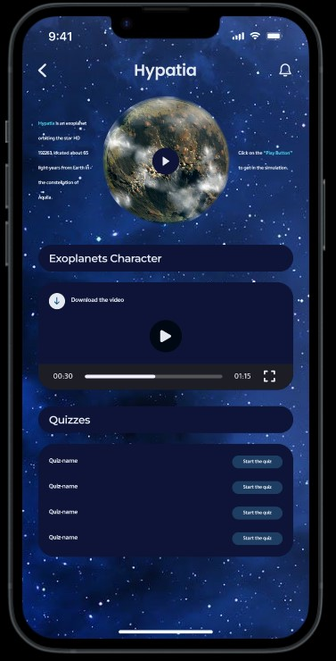
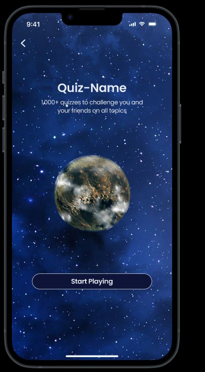
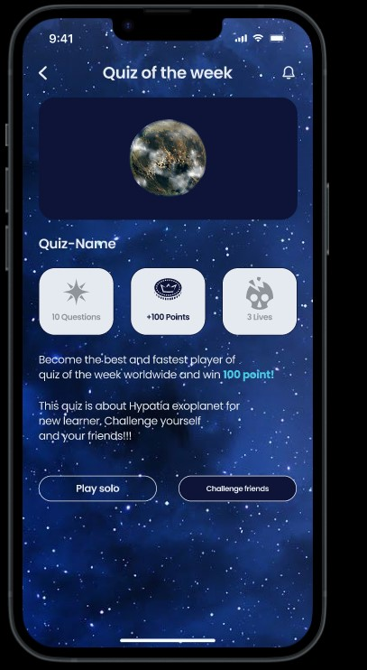
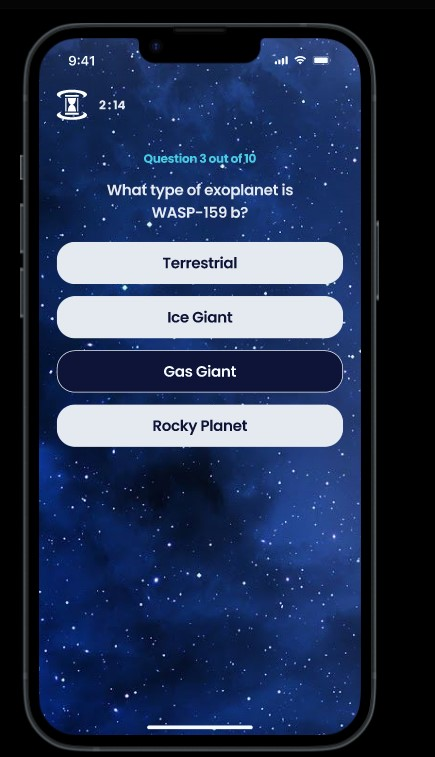
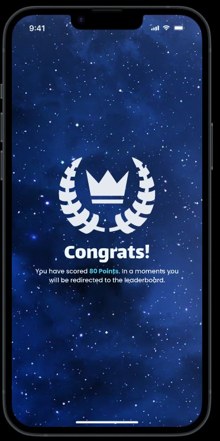
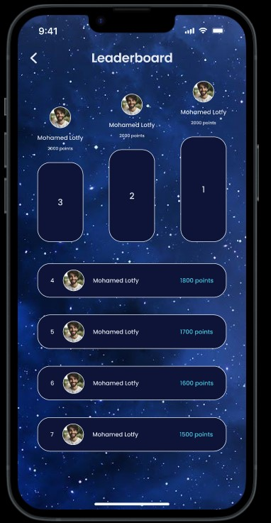

# Astroid

## 1. Homepage

<br>
The homepage serves as the main dashboard, showcasing **NASA's upcoming events** related to space exploration and astronomy. It highlights **popular exoplanets**, making it easy for students to start their journey of discovery. Additionally, a **quiz progress tracker** is prominently displayed, allowing users to keep track of their achievements and levels, encouraging continued engagement through gamification.

---

## 2. Exoplanet Details Page

<br>
This screen provides detailed information about a selected **exoplanet**, pulling data from **Eyes on Exoplanets** NASA's resource. In addition to scientific facts, the page features a **web view storytelling mode**, offering an engaging narrative about the exoplanet's history and characteristics. Users can also test their knowledge through **AI-generated quizzes**, tailored to the specific exoplanet they're exploring, fostering interactive learning.

---

## 3. Quiz Page

<br>
The quiz page is where users can dive into interactive learning through **gamified quizzes**. The quizzes are designed to be fun and educational, keeping students engaged while they test their knowledge of exoplanets and astronomy. This screen also displays relevant quiz information, including categories and difficulty levels.

---

## 4. Quiz Type Selection

<br>
On this screen, users can choose their preferred quiz mode. They can either play **solo** to test their individual knowledge or **challenge friends** to see who has the best grasp of exoplanetary facts. This feature adds a social and competitive element to the app, enhancing user engagement through friendly competition.

---

## 5. Challenge Friends Popup

<br>
If the user selects the **challenge friends** option, a popup appears with a **shareable link**. This link can be sent to friends, inviting them to participate in the quiz challenge. The shared link opens the door to group interaction, making learning a collaborative experience.

---

## 6. Quiz Questions

<br>
This screen presents the **quiz questions**. The questions are dynamically generated and adapt based on the user’s quiz type (solo or group challenge). Each question encourages critical thinking and provides instant feedback, allowing users to learn from their mistakes in real time.

## 7. Quiz Results

<br>
Once the quiz is completed, the user is taken to the **results page**, where they can see their score, accuracy, and time taken. The results are accompanied by educational feedback, further enhancing the learning experience. Users can also compare their scores with others, boosting motivation for improvement.

---

## 8. Leaderboard

<br>
The **leaderboard** showcases the top performers in various quiz categories, fostering a competitive yet friendly learning environment. Users can see how their scores stack up against others, promoting ongoing participation and encouraging them to climb the ranks through continued learning and quiz completion.

---

This is a new [**React Native**](https://reactnative.dev) project, bootstrapped using [`@react-native-community/cli`](https://github.com/react-native-community/cli).

# Getting Started

>**Note**: Make sure you have completed the [React Native - Environment Setup](https://reactnative.dev/docs/environment-setup) instructions till "Creating a new application" step, before proceeding.

## Step 1: Start the Metro Server

First, you will need to start **Metro**, the JavaScript _bundler_ that ships _with_ React Native.

To start Metro, run the following command from the _root_ of your React Native project:

```bash
# using npm
npm start

# OR using Yarn
yarn start
```

## Step 2: Start your Application

Let Metro Bundler run in its _own_ terminal. Open a _new_ terminal from the _root_ of your React Native project. Run the following command to start your _Android_ or _iOS_ app:

### For Android

```bash
# using npm
npm run android

# OR using Yarn
yarn android
```

### For iOS

```bash
# using npm
npm run ios

# OR using Yarn
yarn ios
```

If everything is set up _correctly_, you should see your new app running in your _Android Emulator_ or _iOS Simulator_ shortly provided you have set up your emulator/simulator correctly.

This is one way to run your app — you can also run it directly from within Android Studio and Xcode respectively.

## Step 3: Modifying your App

Now that you have successfully run the app, let's modify it.

1. Open `App.tsx` in your text editor of choice and edit some lines.
2. For **Android**: Press the <kbd>R</kbd> key twice or select **"Reload"** from the **Developer Menu** (<kbd>Ctrl</kbd> + <kbd>M</kbd> (on Window and Linux) or <kbd>Cmd ⌘</kbd> + <kbd>M</kbd> (on macOS)) to see your changes!

   For **iOS**: Hit <kbd>Cmd ⌘</kbd> + <kbd>R</kbd> in your iOS Simulator to reload the app and see your changes!

## Congratulations! :tada:

You've successfully run and modified your React Native App. :partying_face:
